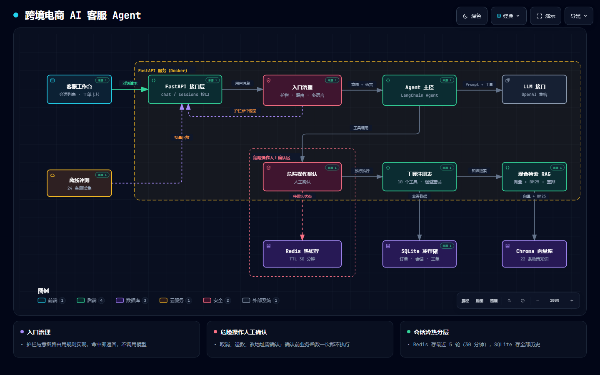
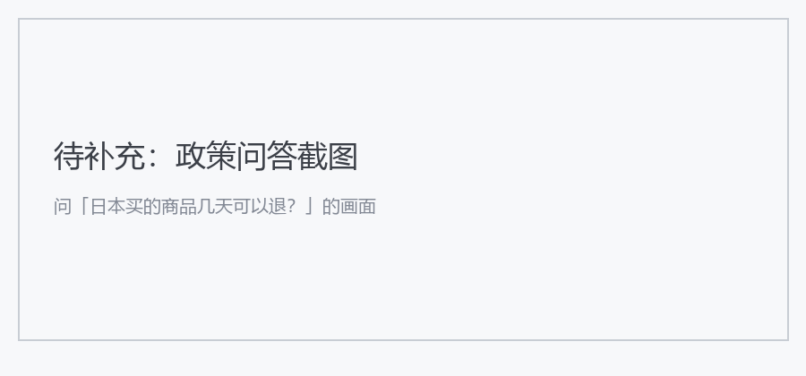
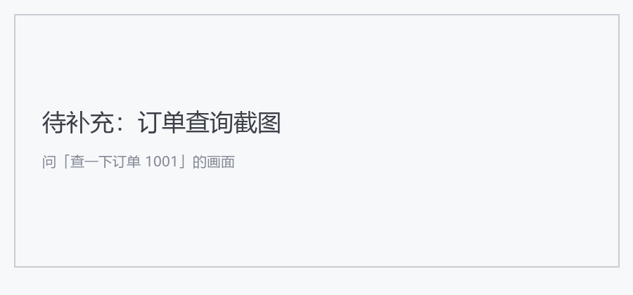
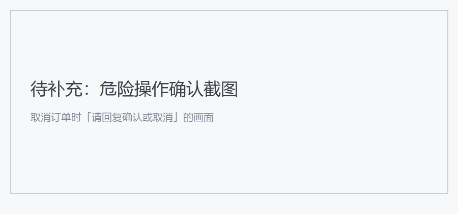

# 跨境电商 AI 客服 Agent

> An LLM-powered customer-service agent for cross-border e-commerce: tool calling with human-in-the-loop confirmation, hybrid-search RAG, and Redis-backed conversation state.

面向**跨境电商**场景落地的 AI 客服 Agent。用户用自然语言提问，Agent 自主决定查订单、查政策还是取消订单；涉及改数据的操作会先暂停、写入待确认状态，用户明确确认后才真正执行。



---

## 为什么做这个

跨境电商客服有两类高频问题，性质完全不同：

| 问题类型 | 例子 | 需要的能力 |
|---|---|---|
| **订单类** | "我的订单 1001 到哪了" | 查数据库，结果必须准确 |
| **政策类** | "日本买的几天能退" | 检索知识库，答案要有依据 |

而"帮我取消订单"这类操作会**修改数据**，不能让模型直接执行。

所以这个项目的核心不是"接了个大模型"，而是解决三件事：**工具怎么管、危险操作怎么拦、知识怎么检索得准**。

---

## 核心设计

### 1. 工具调用体系（装饰器注册）

工具用装饰器注册，描述即提示词，参数从函数签名自动提取：

```python
@tool("cancel_order", "取消指定订单，会修改订单状态，需要用户确认", dangerous=True)
def cancel_order_tool(order_id: int):
    return cancel_order(order_id)
```

运行时经过统一分发层，负责白名单校验、参数校验、指数退避重试：

- 只重试 `TimeoutError` / `ConnectionError`，业务错误不重试
- 退避策略 1s → 2s → 4s，单个工具最多执行 3 次
- 模型传错参数时返回结构化错误，而不是抛异常

### 2. 危险操作人工确认

`cancel_order` 被标记 `dangerous=True`，由中间件拦截：

```
用户：帮我取消订单 1001
  ↓
中间件拦截 → 写入 Redis pending_action（TTL 30 分钟）
  ↓
Agent：确定要取消订单 1001 吗？请回复"确认"或"取消"
  ↓
用户：确认
  ↓
真正执行 → 清除 pending_action
```

关键点：**未确认前，业务函数一次都没被调用过**，不存在"先斩后奏"。

### 3. 混合检索 RAG

政策类问题不走裸向量检索，而是两阶段：

```
向量检索（Chroma）+ 关键词检索（BM25）
        ↓  Min-Max 归一化融合
        ↓  Cross-Encoder 重排（bge-reranker-v2-m3）
        ↓  Top-K
        ↓  交给模型组织答案
```

纯向量检索对"7 天""3 个工作日"这类精确数字召回差，加 BM25 后明显改善。

### 检索质量实测

| 问题 | 仅混合检索（Top1） | 加 Cross-Encoder 重排（Top1） |
|---|---|---|
| 日本多久到货？ | ❌ 退货政策「日本 7 天内可退」 | ✅ 物流时效「5 到 8 个工作日」 |
| 美国退货几天？ | ✅ 美国 30 天无理由退货 | ✅ 美国 30 天无理由退货 |

第一条是典型失败案例：向量检索把"日本"这个词的权重放得过大，导致"多久到货"被错误召回成退货政策。**Cross-Encoder 重排修正了 Top1**——这也是这个项目没有停在"向量 + BM25"的原因。

### 4. 状态管理

Redis 存两类状态，TTL 均为 30 分钟：

- `conversation:{user_id}` —— 最近 5 轮对话历史
- `agent_state:{user_id}` —— 待确认的危险操作

订单数据存 SQLite，工程上够用且零运维。

---

## 技术栈

| 层 | 选型 |
|---|---|
| Web 框架 | FastAPI |
| Agent | LangChain `create_agent` |
| 工具 | 自研装饰器注册表 + 指数退避 |
| 向量库 | Chroma（持久化） |
| 关键词检索 | BM25（rank_bm25） |
| 重排 | Cross-Encoder `bge-reranker-v2-m3` |
| 会话/状态 | Redis |
| 订单数据 | SQLite |
| 部署 | Docker Compose（agent + redis） |

---

## 快速开始

```bash
# 1. 安装依赖
pip install -r requirements.txt

# 2. 配置环境变量（项目根目录建 .env）
IKUNCODE_API_KEY=你的key

# 3. 灌入知识库（首次必须执行，否则政策类问题答不出）
python tests/test_rebuild_knowledge.py

# 4. 启动服务
uvicorn app.main:app --reload
# 或 docker compose up -d
```

打开 http://localhost:8000 即可对话；`/health` 查看服务状态。

---

## 实测效果

### 场景一：政策问答（走 RAG）

用户问退货时限，Agent 调用 `search_knowledge`，经混合检索 + 重排取回政策后作答。



```
用户：日本买的商品几天可以退？
Agent：日本地区消费者在签收商品后的 7 天内可以申请退货。
```

### 场景二：订单查询（走工具调用）

Agent 自主选择 `get_order_record`，从 SQLite 读出订单状态。



```
用户：查一下订单 1001
Agent：订单 1001，商品 XXX，当前状态：已发货。
```

### 场景三：取消订单（危险操作人工确认）

**这是本项目的核心机制**：`cancel_order` 被中间件拦截，写入 Redis 待确认状态，**在用户确认前业务函数一次都没有被执行**。



```
用户：帮我取消订单 1001
Agent：确定要取消订单 1001 吗？请回复"确认"或"取消"
用户：确认
Agent：订单 1001 已取消。
```

> 截图存放位置：`docs/screenshot-knowledge.png`、`docs/screenshot-order.png`、`docs/screenshot-confirm.png`

---

## 目录结构

```
app/
├── main.py              FastAPI 入口
├── api/chat.py          对话接口 /api/chat
├── agent/
│   ├── agent.py         Agent 主控
│   ├── registry.py      工具注册表（装饰器 + 重试）
│   ├── middleware.py    危险操作拦截
│   └── langchain_tools.py
├── tools/               业务工具实现（订单 / 知识库）
├── rag/                 分块、向量、BM25、混合检索、重排
├── memory/              Redis 会话与待确认状态
└── database/            SQLite 订单表
```

---

## Roadmap

- [ ] Agent 效果评测（ragas / LLM-as-Judge）
- [ ] 全链路可观测（trace / 成本统计）
- [ ] 异步化 + 流式输出
- [ ] LangGraph 化，状态机编排
- [ ] 工具 MCP 化

---

## English Summary

An AI customer-service agent for **cross-border e-commerce** built with FastAPI + LangChain.

**Highlights**

- **Tool calling with governance**: actions registered via decorator; a central dispatcher handles whitelist checks, argument validation, and exponential-backoff retry.
- **Human-in-the-loop for destructive actions**: `cancel_order` is intercepted by middleware, stored as a pending action in Redis, and only executed after explicit user confirmation — the business function is never called before confirmation.
- **Hybrid RAG**: Chroma vector search + BM25 keyword search, fused with min-max normalization, then reranked by a Cross-Encoder. Plain vector retrieval recalls poorly on exact figures like "7 days".
- **State**: Redis for conversation history and pending actions (30-min TTL); SQLite for orders.

**Stack**: Python · FastAPI · LangChain · Chroma · BM25 · Cross-Encoder · Redis · SQLite · Docker Compose

---

## License

MIT
